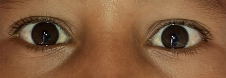

# Strabismus Detection Tensorflow Model

This Tensorflow Model can classify Strabismus eyes and No Strabismus Eyes as normal by Image of eyes.

## Documentation

Please check out the [Documentation website](https://eyebouimpact.github.io/Documentation/) for more details.

## Model Description

The model has 4 convolutional layers with max pooling between them. layers use 64, 96, 128 and 204 filters respectively. A flatten layer comes after these convolutional layers to flat the created 3d tensors. Then the extracted features gave to a 512 units fully connected layer followed by two other fully connected layers that has 256 and 128 units respectively.

### Test Results

Results on the test data after training:

| Measure           | Value |
| ----------------- | ----- |
| Balanced Accuracy | 70.8% |
| Sensitivity       | 66.6% |
| Specificity       | 75%   |

### Model Input Data

The model gets 23:9 ratio image of eyes as input to detect strabismus. A sample image of input data is given below.

## Installation Instructions

1. Make sure [git-lfs](https://git-lfs.com/) is installed. Otherwise the model won't be properly downloaded.
1. Fork the repository (you need your own repository to submit a pull request)
1. Clone your repository: `git clone git@github.com:example-username/example-repository-name.git`
1. Install dependencies: `pip install -r requirements.txt`
1. Test if example works: `python strabismus_predict.py`

## Usage Instructions

You can use use this model in two ways.

1. Use presented function with python.
2. Use model in your way.

### Use presented function with python

To use "strabismus_predict" function give it image path as string.
